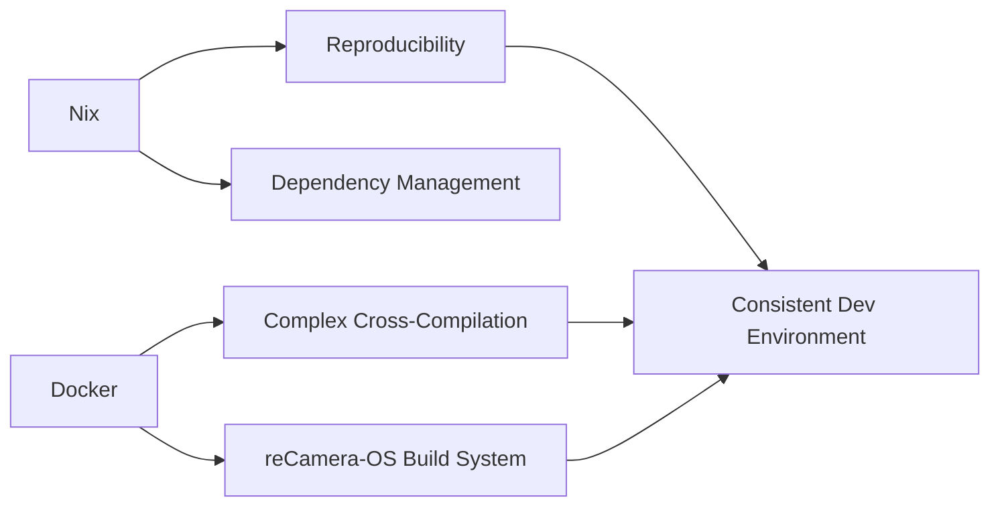

# Contributing to SSCMA Example SG200X

Thank you for your interest in contributing! This guide explains our development setup and workflow.

## Development Environment

### Why Nix + Docker?

Our build system combines Nix and Docker for specific reasons:



**Nix provides:**
- Reproducible builds across all contributor machines
- Declarative dependency management
- Hermetic build environment

**Docker handles:**
- Complex cross-compilation (RISC-V toolchain, bootstrapping)
- reCamera-OS build system requirements
- *Note: Nix cross-compilation doesn't work for this embedded system*

### SDK Build Process

The SDK build is integrated into [`flake.nix`](flake.nix:1) and runs automatically:

#### Phase 1: Source Preparation
```nix
recamera-os = {
  url = "github:Seeed-Studio/reCamera-OS?ref=sg200x-reCamera";
  flake = false;
};
```
- Fetches fixed commit from reCamera-OS
- Ensures reproducibility across all contributors

#### Phase 2: Docker Build
```bash
# Inside Nix derivation
bash ./docker_build.sh sg2002_recamera_emmc
```

This runs the complete reCamera-OS build:
1. **Buildroot** - Creates toolchain and sysroot
2. **U-Boot** - Bootloader for SG200X
3. **Linux Kernel** - RISC-V kernel (v5.10)
4. **TPU SDK** - Neural processing unit runtime
   - cviruntime - TPU runtime
   - cvikernel - TPU kernels
   - cvimath - Math operations
5. **Middleware** - Media processing (cvi_mpi, cvi_rtsp)
6. **Computer Vision** - OpenCV, IVE, IVS, TDL SDKs

#### Phase 3: SDK Extraction
```bash
# Extract to Nix store
tar -xzf output/.../sg2002_recamera_emmc_sdk.tar.gz -C $out
```

#### Phase 4: Caching
- SDK is stored in Nix store (`/nix/store/...`)
- Hash-based caching ensures rebuilds only when source changes
- Team can share via binary cache

### Build Timeline

**First contributor on a machine:**
- Initial build: 1-2 hours
- Downloads: ~500MB (sources)
- Disk usage: ~30GB (build artifacts)
- Result: Cached in Nix store

**Subsequent contributors (with binary cache):**
- Download pre-built: 5-10 minutes
- Disk usage: ~2GB (final SDK only)

**All subsequent `nix develop`:**
- Uses cached SDK: <1 minute
- No rebuild unless source changes

## Development Workflow

### Setup

```bash
# 1. Clone repository
git clone <repo-url>
cd sscma-example-sg200x

# 2. Enter development environment
nix develop
# First time: Builds SDK (1-2 hours, shows progress)
# Later: Uses cache (<1 minute)
```

### Making Changes

#### To Application Code

```bash
cd solutions/helloworld
# Modify your code
cmake -B build -DCMAKE_BUILD_TYPE=Debug .
cmake --build build
```

Changes to application code don't trigger SDK rebuild.

#### To SDK Integration

If you modify [`flake.nix`](flake.nix:1) (SDK build process):

```bash
# Force rebuild
nix develop --rebuild

# Or clean cache first
nix-store --delete /nix/store/<sdk-hash>
nix develop
```

### Testing

```bash
# Unit tests
cd test
cmake -B build && cmake --build build
./build/test_runner

# Integration tests
./scripts/run_integration_tests.sh
```

### Deploying to Device

```bash
# Copy to reCamera via SSH
scp build/your_app root@recamera.local:/tmp/
ssh root@recamera.local '/tmp/your_app'
```

## Understanding the Flake Structure

### Key Sections

```nix
# flake.nix structure
{
  inputs = {
    # ... dependencies ...
    recamera-os = { /* SDK source */ };
  };
  
  outputs = {
    packages.recamera-sdk = /* SDK builder derivation */;
    devShells.default = /* Your dev environment */;
  };
}
```

### SDK Builder Derivation

Located in [`flake.nix`](flake.nix:42):

```nix
recamera-sdk = pkgs.stdenv.mkDerivation {
  name = "recamera-sdk-sg2002_recamera_emmc";
  src = recamera-os;  # Fetched from GitHub
  
  # Docker is required because:
  # 1. Complex cross-compilation (RISC-V)
  # 2. Buildroot bootstrapping
  # 3. Multiple interdependent toolchains
  # 4. reCamera-OS build system expects Docker
  
  buildPhase = ''
    # Runs docker_build.sh inside Nix sandbox
    # This is impure but necessary for this build system
  '';
  
  installPhase = ''
    # Extracts SDK to $out (/nix/store/...)
  '';
};
```

### Why `__impure = true`?

```nix
__impure = true;  # Required for Docker
```

Docker requires access to the Docker daemon, which is outside Nix's pure build sandbox. This is a necessary compromise for this project because:
- reCamera-OS build system is Docker-based
- Nix cross-compilation alternatives don't work for this embedded system
- The impurity is contained and well-defined

## Binary Cache Setup (For Maintainers)

### Using Cachix

```bash
# 1. Create Cachix cache
cachix create sscma-sg200x

# 2. Build and push
nix build .#recamera-sdk
cachix push sscma-sg200x $(nix path-info .#recamera-sdk)

# 3. Contributors use cache (add to flake.nix)
nixConfig = {
  extra-substituters = [ "https://sscma-sg200x.cachix.org" ];
  extra-trusted-public-keys = [ "..." ];
};
```

### Using GitHub Actions

See [`.github/workflows/build-sdk.yml`](.github/workflows/build-sdk.yml:1) for CI setup.

## Common Issues

### "Cannot connect to Docker daemon"

**Cause**: Docker daemon not running or not accessible

**Solution**:
```bash
# Start Docker
sudo systemctl start docker  # Linux
# or launch Docker Desktop    # macOS/Windows

# Verify
docker ps
```

### "No space left on device"

**Cause**: SDK build needs ~30GB

**Solution**:
```bash
# Check space
df -h

# Clean Nix store
nix-collect-garbage -d

# Clean Docker
docker system prune -a
```

### "Build failed: Git not initialized"

**Cause**: reCamera-OS build system expects Git repository

**Solution**: Already handled in derivation, but if you see this:
```bash
cd $(nix path-info .#recamera-sdk.src)
git init
```

### SDK Seems Out of Date

**Cause**: Nix is using cached version

**Solution**:
```bash
# Update flake inputs
nix flake update

# Force rebuild
nix develop --rebuild
```

## Project Structure

```
sscma-example-sg200x/
├── flake.nix          # Nix flake with SDK integration
├── flake.lock         # Locked dependency versions
├── solutions/         # Example applications
│   └── helloworld/    # Basic example
├── components/        # Reusable components
├── cmake/             # CMake helpers
├── scripts/           # Build and deploy scripts
└── docs/              # Documentation
```

## Code Style

- C/C++: Follow `.clang-format` rules
- Nix: Follow `nixpkgs` style guide
- Commit messages: Conventional Commits format

```bash
# Format code before commit
clang-format -i solutions/**/*.{c,cpp,h}
```

## Pull Request Process

1. **Fork** the repository
2. **Create branch** from `main`
3. **Make changes** with clear commits
4. **Test** your changes (CI will verify)
5. **Update docs** if needed
6. **Open PR** with description

### PR Checklist

- [ ] Code compiles without warnings
- [ ] Tests pass (`nix develop -c ./scripts/run_tests.sh`)
- [ ] Documentation updated (if needed)
- [ ] Commit messages follow convention
- [ ] CI passes

## Questions?

- Open an issue for bugs or feature requests
- Discussion board for questions
- Discord/Slack for real-time help

Thank you for contributing!
