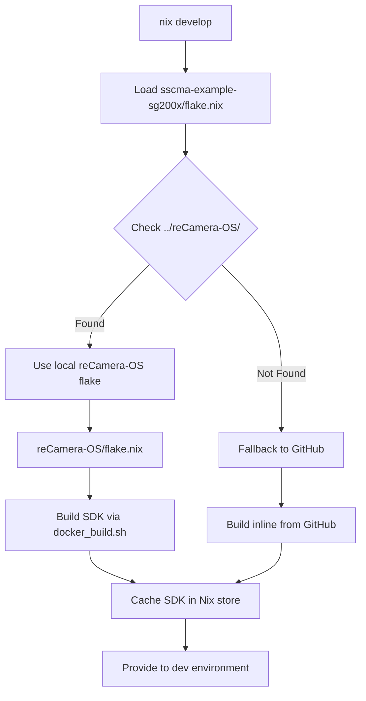

# SSCMA Example for SG200X

Development environment and examples for the SSCMA (Seeed SenseCraft Model Assistant) on SG200X RISC-V platforms.

## Quick Start

This project uses Nix flakes for a fully reproducible development environment. The reCamera-OS SDK is automatically built from the local reCamera-OS flake (if available in [`../reCamera-OS/`](../reCamera-OS/)).

### Prerequisites

- **Nix** with flakes enabled ([Install Nix](https://nixos.org/download.html))
- **Docker** daemon running (required for SDK build)
- **~30GB disk space** for SDK build artifacts  
- **1-2 hours** for first-time SDK build (cached thereafter)
- **reCamera-OS** repository cloned to [`../reCamera-OS/`](../reCamera-OS/) (recommended)

### Setup

```bash
# Clone both repositories (recommended layout)
cd ~/projects
git clone https://github.com/Seeed-Studio/reCamera-OS.git
git clone <sscma-example-repo-url> sscma-example-sg200x

# Enter development environment
cd sscma-example-sg200x
nix develop
```

## How It Works

### Architecture with Local reCamera-OS Flake



### Three-Tier SDK Resolution

1. **Local reCamera-OS Flake** (Preferred)
   - Uses `../reCamera-OS/flake.nix` if available
   - Builds SDK using reCamera-OS's own flake
   - Allows customizing reCamera-OS build
   - Shared cache between projects

2. **Existing Local Build** (Fast)
   - If `../reCamera-OS/output/sg2002_recamera_emmc/` exists
   - Reuses already-built SDK
   - No rebuild needed

3. **GitHub Source** (Fallback)
   - Fetches reCamera-OS from GitHub
   - Builds SDK inline
   - Used when `../reCamera-OS/` doesn't exist

### First Run Timeline

**With local reCamera-OS flake:**
```bash
$ cd sscma-example-sg200x
$ nix develop
Loading reCamera-OS flake from ../reCamera-OS
Building SDK (first time: 1-2 hours)...
[... build progress ...]
✓ SDK cached in Nix store
✓ Development environment ready
```

**Subsequent runs:** <1 minute

### Updating the SDK

#### If using local reCamera-OS:
```bash
cd ../reCamera-OS
git pull
# SDK will rebuild automatically on next `nix develop`
```

#### If using GitHub source:
```bash
# Update flake inputs
nix flake update
nix develop --rebuild
```

## Development

### Build a Solution

```bash
cd solutions/helloworld
cmake -B build -DCMAKE_BUILD_TYPE=Release .
cmake --build build
```

### Available Environment Variables

Inside `nix develop`:
- `$TOOLCHAIN_PATH` - RISC-V gcc toolchain
- `$SG200X_SDK_PATH` - Complete SDK root
- `$TPU_SDK_PATH` - TPU runtime and libraries
- `$PROJECT_ROOT` - Your project root
- `$PKG_CONFIG_PATH` - SDK pkg-config files
- `$LD_LIBRARY_PATH` - SDK shared libraries

### SDK Structure

The built SDK (from reCamera-OS) contains:
```
sg2002_recamera_emmc/
├── buildroot-2021.05/
│   └── output/cvitek_CV181X_musl_riscv64/
│       └── host/riscv64-buildroot-linux-musl/sysroot/
├── cvi_mpi/           # Media processing interface
│   ├── include/
│   ├── lib/
│   └── modules/
├── cvi_rtsp/          # RTSP streaming
│   └── install/
├── install/soc_sg2002_recamera_emmc/
│   ├── rootfs/mnt/system/lib/   # System libraries
│   └── tpu_musl_riscv64/cvitek_tpu_sdk/
│       ├── include/   # TPU headers (cviruntime, cvikernel)
│       ├── lib/       # TPU libraries
│       ├── opencv/    # OpenCV for embedded
│       │   ├── include/
│       │   └── lib/
│       ├── cmake/     # CMake toolchain files
│       └── samples/   # Example apps
├── osdrv/interdrv/    # OS drivers
└── build_output/      # Full build artifacts (for reference)
```

## Working with reCamera-OS

### Customizing SDK Build

1. **Modify reCamera-OS:**
```bash
cd ../reCamera-OS
# Make your changes to the SDK
vim external/configs/sg2002_recamera_emmc_defconfig
```

2. **Rebuild SDK:**
```bash
# Option A: Using reCamera-OS flake directly
nix build .#sdk-sg2002_recamera_emmc

# Option B: Rebuild from sscma-example (will use updated reCamera-OS)
cd ../sscma-example-sg200x
nix develop --rebuild
```

### Build reCamera-OS Manually

If you want to build outside of Nix:
```bash
cd ../reCamera-OS
./docker_build.sh sg2002_recamera_emmc
# SDK output: ./output/sg2002_recamera_emmc/
```

The Nix environment will automatically detect and use this build.

### reCamera-OS Flake Targets

The [`reCamera-OS/flake.nix`](../reCamera-OS/flake.nix:1) supports multiple targets:
```bash
cd ../reCamera-OS

# Build different targets
nix build .#sdk-sg2002_recamera_emmc
nix build .#sdk-sg2002_recamera_sd
nix build .#sdk-sg2002_xiao_sd

# Enter reCamera-OS dev environment
nix develop
```

## Binary Cache Setup (For Teams)

### Using Cachix

Share built SDKs across your team:

```bash
# Maintainer: Set up cache
cachix create sscma-sg200x

# Build and push to cache
cd ../reCamera-OS
nix build .#sdk-sg2002_recamera_emmc
cachix push sscma-sg200x $(nix path-info .#sdk-sg2002_recamera_emmc)

# Contributors: Add to flake.nix
nixConfig = {
  extra-substituters = [ "https://sscma-sg200x.cachix.org" ];
  extra-trusted-public-keys = [ "sscma-sg200x.cachix.org-1:..." ];
};
```

## Troubleshooting

### "Cannot find reCamera-OS flake"

```bash
Error: Cannot find flake '../reCamera-OS'
```

**Solution:** Clone reCamera-OS or use GitHub fallback:
```bash
# Option A: Clone locally (recommended)
cd ..
git clone https://github.com/Seeed-Studio/reCamera-OS.git

# Option B: Modify flake to use GitHub only
# Edit inputs.recamera-os.url in flake.nix
```

### "SDK not found" in Development Environment

If SDK path exists but appears empty:
```bash
# Check build info
cat $(nix path-info .#recamera-sdk)/sg2002_recamera_emmc/.nix-build-info

# Force rebuild
nix build .#recamera-sdk --rebuild
```

### Docker Daemon Not Running

```bash
Error: Cannot connect to Docker daemon
```

**Solution**: Start Docker:
```bash
sudo systemctl start docker  # Linux
# or Docker Desktop          # macOS/Windows
```

### Disk Space Issues

SDK build needs ~30GB:
```bash
# Check space
df -h

# Clean old builds
nix-collect-garbage -d
docker system prune -a

#Clean reCamera-OS output
cd ../reCamera-OS
rm -rf output/
```

### SDK Seems Out of Date

**Cause:** Nix is using cached SDK

**Solution:**
```bash
# Update reCamera-OS
cd ../reCamera-OS
git pull

# Force rebuild from sscma-example
cd ../sscma-example-sg200x
nix develop --rebuild

# Or rebuild SDK directly
cd ../reCamera-OS
nix build .#sdk-sg2002_recamera_emmc --rebuild
```

### Manual Build vs Nix Build

If you built reCamera-OS manually but want to use it with Nix:
```bash
# Manual build
cd ../reCamera-OS
./docker_build.sh sg2002_recamera_emmc

# The Nix environment will automatically detect output/sg2002_recamera_emmc/
cd ../sscma-example-sg200x
nix develop  # Will use existing build
```

## Project Structure

```
sscma-example-sg200x/
├── flake.nix          # Main flake (uses OS SDK repo if present)
├── flake.lock         # Locked dependency versions
├── solutions/         # Example applications
│   └── helloworld/    # Basic example
├── components/        # Reusable components
├── cmake/             # CMake helpers
├── scripts/           # Build and deploy scripts
└── docs/              # Documentation
    ├── oobe_spec.md
    ├── oobe_programming_spec.md
    └── oobe_40hr_plan.md

../authority-alert-OS/ # OS SDK repository (sibling directory, preferred)
../reCamera-OS/        # Legacy name (also supported)
├── flake.nix          # OS flake (builds SDK)
├── docker_build.sh    # Docker-based build script
├── Makefile           # Build system entry
└── output/            # Build artifacts (git-ignored)
```

## Code Style

- C/C++: Follow `.clang-format` rules
- Nix: Follow `nixpkgs` style guide
- Commit messages: Conventional Commits format

```bash
# Format code before commit
clang-format -i solutions/**/*.{c,cpp,h}
```

## Contributing

See [CONTRIBUTING.md](CONTRIBUTING.md) for detailed development guidelines.

## License

See [LICENSE](LICENSE) for details.
